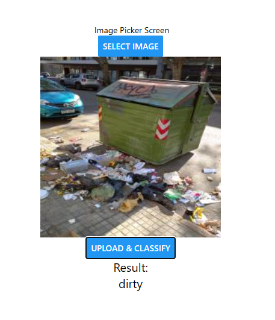

# trash-classification-twise-night-challenge

### classification of trash images by fine tuning vgg16 on 2 classes
### classes=[dirty,clean]

### to run this

### make a python venv

```
python -m venv .venv
cd .venv
cd Scripts
./activate
```

```
pip install requirements.txt
```

### and

```
cd "mobile app"
cd "Trash_Classification"
npm i
```

### to start the mobile app

```
npx expo start
```

### to start the api

```
fastapi run api.py
```

### Application demo

